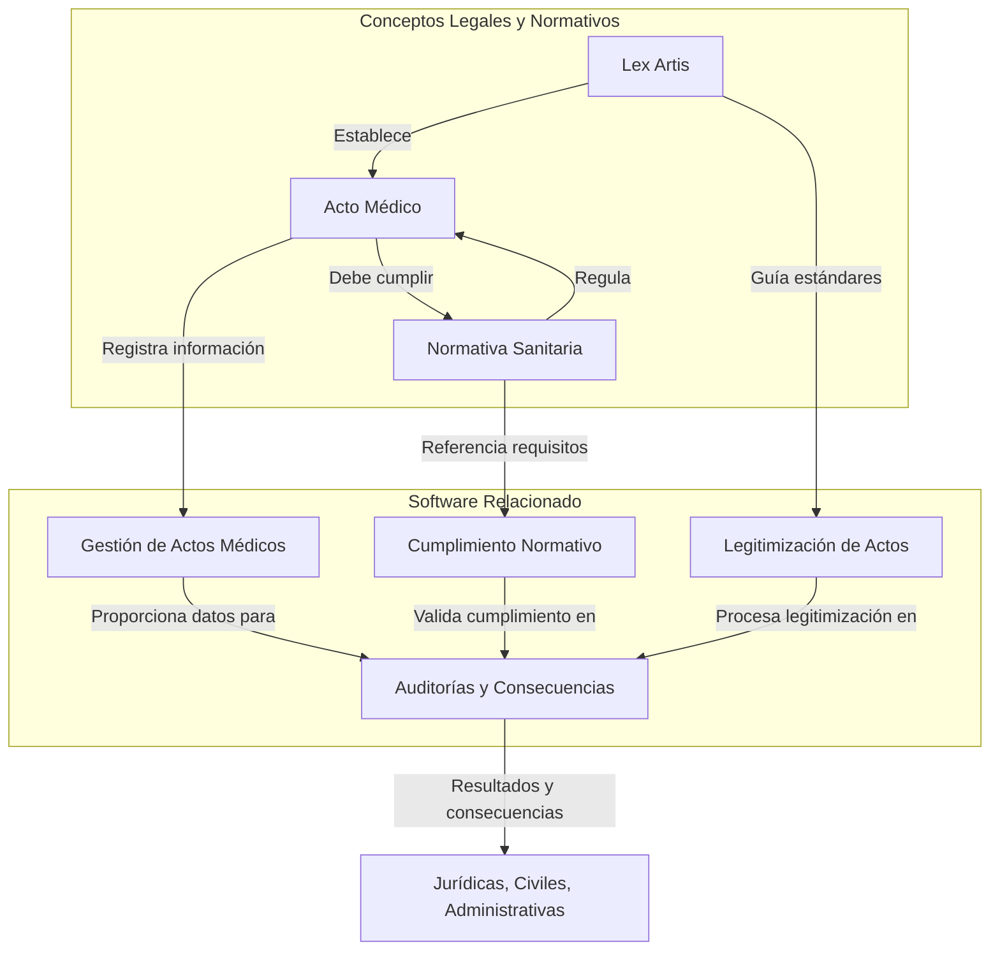

## Lex Artis Concepts

```mermaid
graph TD
    subgraph Conceptos Legales y Normativos
        LexArtis["Lex Artis"]
        ActoMedico["Acto Médico"]
        NormativaSanitaria["Normativa Sanitaria"]
    end

    subgraph Software Relacionado
        Modulo1["Gestión de Actos Médicos"]
        Modulo2["Cumplimiento Normativo"]
        Modulo3["Legitimización de Actos"]
        Modulo4["Auditorías y Consecuencias"]
    end

    LexArtis -->|Establece| ActoMedico
    ActoMedico -->|Debe cumplir| NormativaSanitaria
    NormativaSanitaria -->|Regula| ActoMedico

    ActoMedico -->|Registra información| Modulo1
    NormativaSanitaria -->|Referencia requisitos| Modulo2
    LexArtis -->|Guía estándares| Modulo3
    Modulo1 -->|Proporciona datos para| Modulo4
    Modulo2 -->|Valida cumplimiento en| Modulo4
    Modulo3 -->|Procesa legitimización en| Modulo4

    Modulo4 -->|Resultados y consecuencias| Consecuencias["Jurídicas, Civiles, Administrativas"]

```