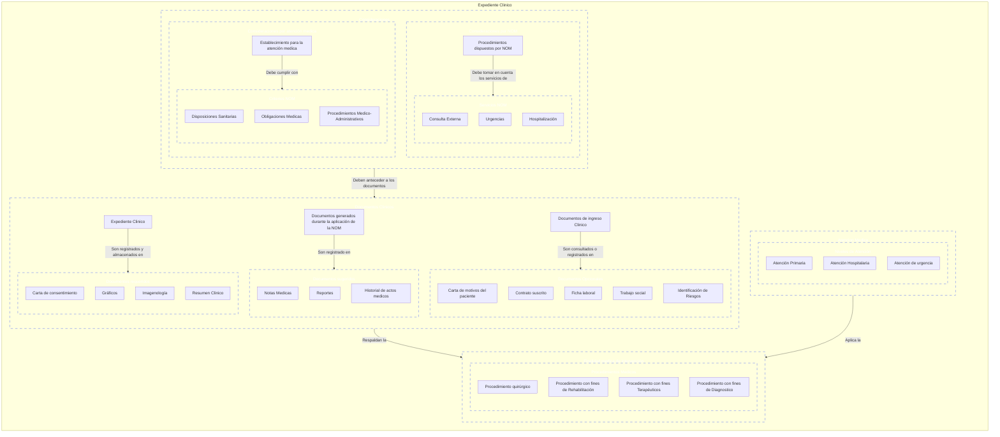

## Clinical Record Aggregates

```mermaid
%%{init: {'themeVariables': { 'fontSize': '18px' }}}%%
flowchart TB
	subgraph medical_record["Expediente Clinico"]
		direction TB
		
		classDef aggregate padding:5em,stroke:#909ff0,stroke-width:2px,color:#fff,stroke-dasharray: 10 10
		
		subgraph considerations["Consideraciones"]
			direction TB
			
			%% De acuerdo con la NOM-004-SSA3-2012 se deben considerar los servicios
			%% medicos otorgados en el ejercicio del registro de expediente clinico.
			subgraph nom_considerations["Consideraciones por NOM"]
			    direction TB
			    
				nom_procedures["Procedimientos dispuestos por NOM"]
				subgraph nom_services["Servicios NOM"]
				    direction TB
				    
				    outpatient_consultation["Consulta Externa"]
				    emergency_services["Urgencias"]
				    hospitalization["Hospitalización"]
				end
			end
			
			%% De acuerdo con la NOM-004-SSA3-2012 también existen consideraciones que
			%% se manejan desde criterios que deben regir dentro de cualquier
			%% establecimiento que otorgue atención medica a pacientes.
			subgraph medical_care_considerations["Consideraciones por atención medica"]
			    direction TB
			    
			    sanitary_facility["Establecimiento para la atención medica"]
			    subgraph nom_criteria["Criterios NOM"]
			        direction TB
			        
			        sanitary_facility_provisions["Disposiciones Sanitarias"]
			        sanitary_facility_obligations["Obligaciones Medicas"]
			        sanitary_facility_administrative_procedures["Procedimientos Medico-Administrativos"]
			    end
			end
		end
		
		subgraph clinical_docs["Documentos Clinicos"]
		    direction TB
		    
		    generated_docs["Documentos generados durante la aplicación de la NOM"]
		    admission_docs["Documentos de ingreso Clinico"]
		    clinical_records["Expediente Clinico"]
            subgraph suggested_docs["Documentos sugeridos"]
                direction TB
                
                medical_notes["Notas Medicas"]
                medical_reports["Reportes"]
                medical_act_history["Historial de actos medicos"]
            end
            
            subgraph optional_docs["Documentos Opcionales"]
                direction TB
                
                patient_motives["Carta de motivos del paciente"]
                subscription_contract["Contrato suscrito"]
                work_record["Ficha laboral"]
                social_work["Trabajo social"]
                risk_detection["Identificación de Riesgos"]
            end
            
            subgraph required_docs["Documentos requeridos"]
                direction TB
                
                consent_form["Carta de consentimiento"]
                medical_graph["Gráficos"]
                medical_imaging["Imagenología"]
                clinical_summary["Resumen Clinico"]
            end
		end
		
		subgraph medical_care["Atencion Medica"]
		    direction TB
		    
		    subgraph medical_care_levels["Niveles de Atención"]
		        direction TB
		        
		        primary_care["Atención Primaria"]
		        hospice_care["Atención Hospitalaria"]
		        urgent_care["Atención de urgencia"]
		    end
		end
		
		subgraph medical_intervention_purpose["Finalidad medica de intervención"]
		    direction TB
		    
		    subgraph medical_procedures["Procedimientos Medicos"]
		        direction TB
		        
		        surgical_procedure["Procedimiento quirúrgico"]
		        rehabilitative_procedure["Procedimiento con fines de Rehabilitación"]
		        therapeutic_procedure["Procedimiento con fines Terapéuticos"]
		        diagnostic_procedure["Procedimiento con fines de Diagnostico"]
		    end
		end
	end

  sanitary_facility -->|Debe cumplir con| nom_criteria
  nom_procedures -->|Debe tomar en cuenta los servicios de| nom_services
  considerations:::aggregate -->|Deben anteceder a los documentos| clinical_docs:::aggregate
  
  generated_docs -->|Son registrado en| suggested_docs
  admission_docs -->|Son consultados o registrados en| optional_docs
  clinical_records -->|Son registrados y almacenados en| required_docs
  
  clinical_docs -->|Respaldan la| medical_intervention_purpose
  medical_care -->|Aplica la| medical_intervention_purpose
  
  class nom_considerations,medical_care_considerations,nom_services,nom_criteria,suggested_docs,optional_docs,required_docs,medical_care,medical_care_levels,medical_intervention_purpose,medical_procedures aggregate;
```
